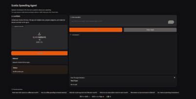
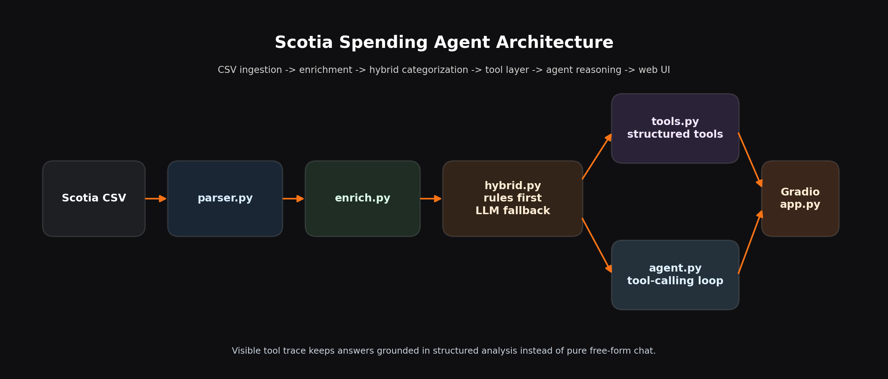

# Scotia Spending Agent

> Tool-calling personal finance agent for Scotiabank credit card data.

This project turns raw Scotia Visa CSV exports into an interactive spending analyst. It validates the data, categorizes merchants with a rules-first + LLM-fallback pipeline, exposes structured analytics tools, and lets an LLM decide which tools to call to answer natural-language questions.

It is intentionally not just "LLM in, text out". The interesting part is the agent loop: the model sees a small set of analysis tools, calls them, reads their structured outputs, and produces a grounded answer. The Gradio app also shows the tool trace so the reasoning is visible.

## Live Demo

- Hugging Face Space: https://huggingface.co/spaces/Jake46/Scotia_Spending_Agent
- Direct app URL: https://Jake46-Scotia-Spending-Agent.hf.space
- The public demo loads the bundled anonymized sample dataset by default, so visitors can ask questions immediately.
- Visitors can also upload their own Scotia CSV and choose whether to `overwrite` the current dataset or `append` and dedupe exact duplicate rows.

## Demo

### Demo GIF



Suggested recording flow:

1. Upload a Scotia CSV
2. Ask: `What are my subscription costs for each month?`
3. Show the answer plus the tool trace using `get_grouped_category_trend`

## What It Can Do

- Start with a bundled anonymized sample dataset so visitors can try the app immediately
- Load a real Scotia CSV export and validate every row with Pydantic
- Let users upload their own CSV and choose whether to:
  - overwrite the current dataset
  - append to the current dataset and dedupe exact duplicate transactions
- Categorize transactions with hybrid logic:
  - fast deterministic rules for common merchants
  - LLM fallback for long-tail merchants and ambiguous strings
- Answer natural-language questions such as:
  - "How much did I spend on coffee last month?"
  - "Has my coffee spending increased recently?"
  - "What are my subscription costs for each month?"
  - "Do I have any pending transactions?"
- Show the tools used to answer each question
- Cache successful LLM categorizations locally so repeat loads get faster

## Current Status

- `Phase 0`: Environment and tooling setup complete
- `Phase 1`: Parser + rule-based categorization complete
- `Phase 2`: Hybrid categorization + tool-calling agent complete
- `Phase 3`: Gradio UI running locally with default sample-data flow
- `Phase 4`: First public Hugging Face demo is live; post-deploy validation and polish are next

## Architecture

### Architecture Diagram



```text
CSV
  -> parser.py
  -> enrich.py
  -> hybrid.py (rules first, LLM on miss)
  -> tools.py (structured analytics/search tools)
  -> agent.py (multi-step tool-calling loop)
  -> app.py (Gradio UI)
```

Core modules:

- [src/scotia_agent/parser.py](src/scotia_agent/parser.py)
  Loads Scotia CSVs, validates rows with Pydantic, preserves Scotia sign conventions.
- [src/scotia_agent/categories.py](src/scotia_agent/categories.py)
  Ordered keyword rules with merchant alias handling.
- [src/scotia_agent/llm_categorize.py](src/scotia_agent/llm_categorize.py)
  OpenAI-compatible LLM fallback with retries, defensive parsing, and local cache.
- [src/scotia_agent/hybrid.py](src/scotia_agent/hybrid.py)
  Rules first, LLM on miss.
- [src/scotia_agent/tools.py](src/scotia_agent/tools.py)
  Agent-facing analysis/search tools plus tool schemas and dispatch.
- [src/scotia_agent/agent.py](src/scotia_agent/agent.py)
  Domain-specific multi-tool reasoning loop.
- [app.py](app.py)
  Gradio UI for sample-data-first usage, CSV upload, Q&A, and tool-trace display.

## Why This Is Interesting

The project is trying to demonstrate a few things that are useful in ML / AI engineering interviews:

- End-to-end data flow from messy real CSVs to an interactive application
- Hybrid system design instead of "send everything to an LLM"
- Agent architecture with tool calling and transparent reasoning
- Production-minded choices: validation, tests, explicit contracts, graceful degradation
- Willingness to document tradeoffs, limitations, and failure modes

## Tool Layer

The current tool set is intentionally small and structured:

- `get_spending_by_category`
- `get_top_merchants`
- `get_monthly_trend`
- `get_grouped_category_trend`
- `search_transactions`

These cover:

- category totals
- merchant drill-down
- monthly trends
- grouped-category questions such as subscriptions / dining / shopping / transport
- raw transaction lookup for pending rows, credits, exact searches, and edge cases

## Categorization Strategy

The categorizer is hybrid by design:

- **Head of the distribution**: keyword rules
  Fast, deterministic, cheap, easy to test.
- **Tail of the distribution**: LLM fallback
  Handles one-off merchants, legal-entity strings, and genuinely ambiguous cases.

This gives a better cost/quality tradeoff than classifying every transaction through the model.

## Quality Snapshot

The rule layer is measured on both row coverage and dollar coverage because row hit rate alone can hide economically important misses.

Current reported results on real data:

- Rule hit rate: `93.7%` by row
- Rule hit rate: `95.9%` by dollars
- Eval set: `29/31 = 93.5%` overall
- Rule layer: `6/6`
- LLM layer: `23/25`

See:

- [tests/test_categories.py](tests/test_categories.py)
- [eval/README.md](eval/README.md)
- [DESIGN.md](DESIGN.md)

## Quick Start

### Try The Public Demo

Open the live Space:

- https://huggingface.co/spaces/Jake46/Scotia_Spending_Agent

The demo starts with the anonymized sample dataset already loaded. You can also upload your own Scotia CSV and choose `overwrite` or `append`.

### Prerequisites

- Python `3.11+`
- [uv](https://github.com/astral-sh/uv)

### Install

```bash
git clone https://github.com/jakki-Guan/scotia-spending-agent.git
cd scotia-spending-agent
uv sync --group dev --group llm --group ui
```

### Configure

Create a `.env` file with your OpenAI-compatible provider settings, for example:

```env
LLM_API_KEY=your_key_here
LLM_BASE_URL=https://openrouter.ai/api/v1
LLM_MODEL=deepseek/deepseek-chat-v3:free
LLM_FALLBACK_ENABLED=true
```

If you only want to work on the non-LLM parts, you can leave `LLM_FALLBACK_ENABLED=false`.

### Run The Gradio App

```bash
uv run python app.py
```

By default, the app preloads `data/sample_anonymized.csv`, so you can ask questions immediately.

You can also upload your own Scotia CSV and choose:

- `overwrite`: replace the current dataset
- `append`: merge new rows into the current dataset and remove exact duplicates

### Run The CLI Agent

```bash
uv run python -m scotia_agent.agent \
  --csv data/raw/your_file.csv \
  --show-trace \
  "Has my coffee spending increased recently?"
```

### Run Tests

```bash
uv run pytest -q
```

## Local Cache

Successful LLM categorization results are cached locally at:

```text
.cache/llm_category_cache.json
```

This improves repeated loads of the same dataset or repeated merchants across sessions. Fallback/error results are not cached.

## Sample Data

The repository now includes:

```text
data/sample_anonymized.csv
```

This file is derived from real Scotia data but anonymized to remove real merchant names, exact locations, exact dates, and exact amounts while preserving the Scotia CSV shape and the broad spending patterns needed for the demo.

## Project Structure

```text
scotia-spending-agent/
├── app.py
├── README.md
├── DESIGN.md
├── eval/
├── tests/
├── src/scotia_agent/
│   ├── agent.py
│   ├── categories.py
│   ├── config.py
│   ├── enrich.py
│   ├── hybrid.py
│   ├── llm_categorize.py
│   ├── parser.py
│   └── tools.py
└── pyproject.toml
```

## Design Notes

A few deliberate choices:

- Pydantic row-by-row validation instead of silent batch coercion
- `(df, errors)` return shape so bad rows surface instead of disappearing
- Preserve Scotia's debit-positive / credit-negative convention
- Ordered rules table rather than a dict, because precedence matters
- JSON-like tool outputs so the LLM consumes structure, not formatted prose
- Small tool surface area to keep the agent controllable

Longer rationale lives in [DESIGN.md](DESIGN.md).

## Limitations

- The public demo is live, but it still needs a few rounds of external-user validation
- First load of a new dataset can be slow because uncached long-tail merchants may hit the LLM
- The agent is tuned for spending analysis, not general personal-finance planning
- Some grouped financial questions still want additional tools in the future
  Examples: recurring charges, month-over-month comparisons, anomaly detection
- Uploaded CSVs are session-scoped in the Gradio app rather than a persistent personal workspace

## Next Steps

- Validate the live public demo with a few representative questions and note any weak spots
- Tighten the README based on real public usage feedback
- Decide whether the next improvement should be more analytics tools or demo hardening

## License

MIT
